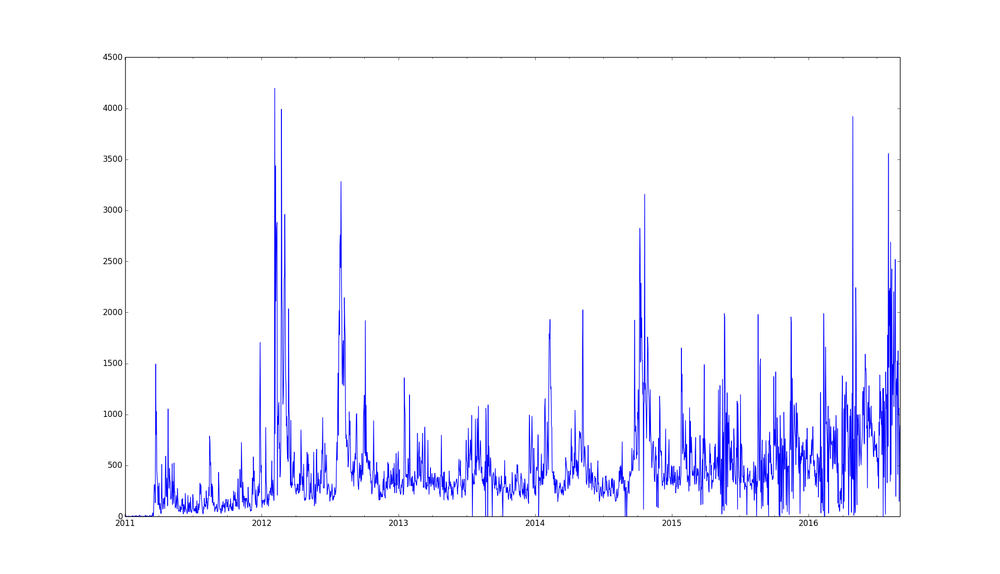
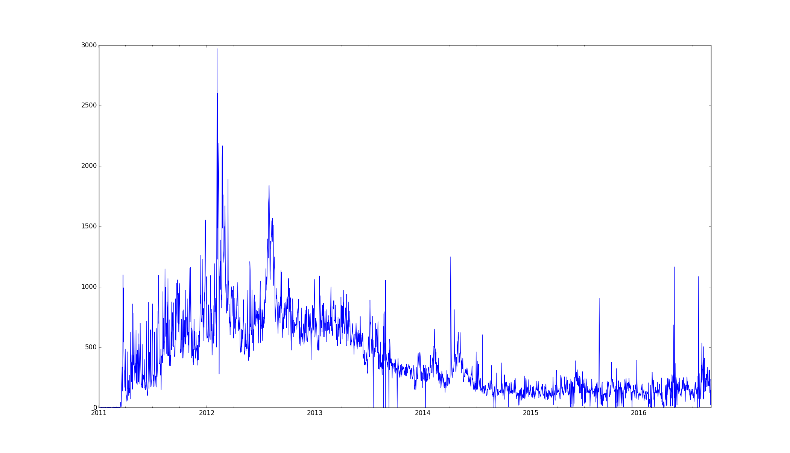
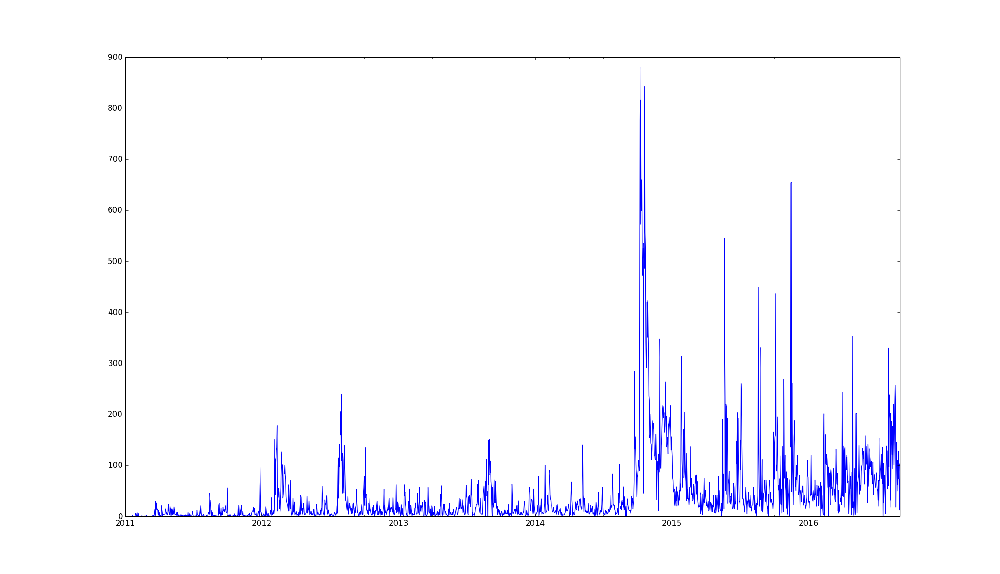
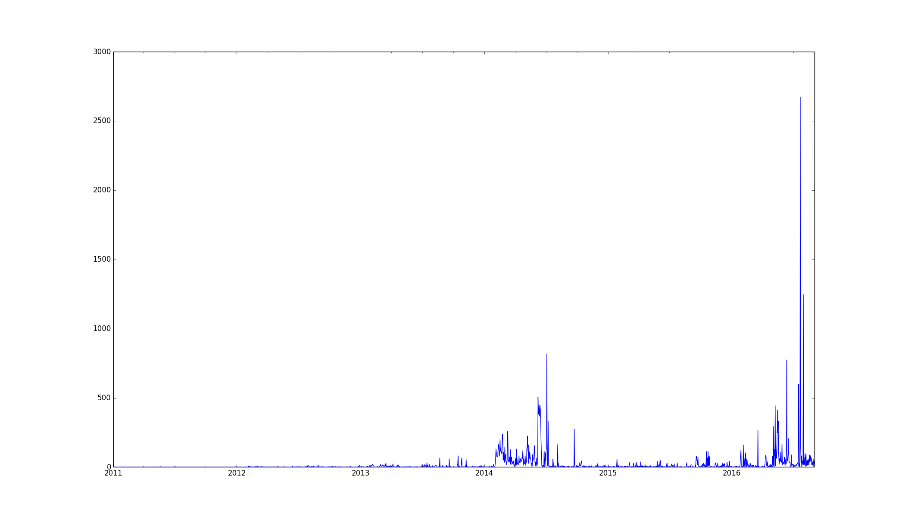

The discussion about the ongoing war in the context of geo-politics, modern warfare, and even morality is one that is as important as it is active.    
The more we discuss the war, the more we learn from it, and the less likely we are to repeat it. 

But the discussion of war itself is reflecting those same issues  it attempts to make sense of.   
The human tendency for discussing the atrocities of war, and the ease of which one can, with malice or without, lead discussions and persuade the impressionable is not left unnoticed by the leading actors and the partisans the war gave birth to.

When cyber-propaganda has entered the discussion, the discussion itself turned self referential, and in fact, as relevant to the fields of geo-politics, modern warfare, and morality as the the war itself.

And so, we can find as much value from the discussion as we can from the meta-discussion. What do those who discuss say, why do they say it, when do they say it, who do they say it to, and is there anyone listening?

For decades, questions of meta-discussion like “What does the Iranian population in England think about the [*Tiger Forces*](https://en.wikipedia.org/wiki/Tiger_Forces)?”  
could only be answered by expensive, inefficient, and unreliable surveys, if it could be answered at all. 

But the data revolution the world went through since the invention of the internet changed it all. People voice their opinions in public forums like *Twitter* with their age, names, and locations. Through their posting habits we can learn more about complete strangers than we know about our neighbours.   
  
While in the past few years the horrifying consequences of a data-revolution that evolves faster than a privacy-revolution became clear, the availability of billions of tagged *“strings of thought”* give a place for a new sort of research and data analysis work.   
  
We no longer need to run around looking for members of a targeted group to answer our questions. We don’t have to assume on their account. These group are already active in the internet, and more likely than not, have members who already answered our questions on a public forum in the past.    
  
## The importance of context

In my first article in the series, [*”The Most Documented War in History: The TOW Program*”](http://www.dzautner.com/the-most-docoumented-war-in-history-the-tow-program/), I conducted the research on a super-community of all users the have ever posted about the Syrian Civil War.   
	  
But reality is more complicated. Analysing what all of the people that ever posted about the war think about the revolution is a meaningless questions that would lead to meaningless answers, because it lacks context. If 90% of the users in the super-group support the revolution, but 90% of them are Dutch, it doesn’t give us the answer to “What does the world think of the revolution” but mostly “What Dutch people think of the revolution”, or more precisely, “What Dutch people on Twitter think of the revolution.”

For the same data that proved useful when researching the war to be useful when researching the discussion about the war, a second layer of meta-data and context is necessary before drawing any meaningful conclusions.
   
## Sub-communities

The problem of researching one giant community, is that all of its members are by definition the same. They are all equal parts of the same whole. But in reality, every significant online community can be comfortably divided into smaller, more contextual communities. 

For example, if we have a Twitter community of 10,000 students from Finland, we could easily divide them into groups of users who mostly follow each other. If Users A, B, and C all follow each other, but only User C follows User D who follow none of the previous, we can safely assume that users A, B, and C form a sub-community which User D is not a part of.

  

If we check what is common between the users in the sub-community (User’s location? Timezone? Same commonly used words? Same shared links?) we could get significant context about **who** are they, why did they cluster together in the Finnish students super community? Do they study in the same school? Are they a part of some political movement? This problem of dividing communities into smaller sub-communities is well discussed in science and is known as  [*“Community Detection”*](https://arxiv.org/abs/0906.0612).

From [my previous research on the TOW program](http://www.dzautner.com/the-most-docoumented-war-in-history-the-tow-program/) I already had a valuable and significantly sized dataset of users active in the greater Syrian Civil War Twitter community.

By describing these users and their connections as a graph I was able to apply [a number of community detection algorithms](http://www.nature.com/articles/srep30750) and pick the one that produced the most distinctive sub-communities. (In this case, that algorithm proved to be [*”Waltrap”*](https://www-complexnetworks.lip6.fr/~latapy/PP/walktrap.html).)

## Sub-community specific attributes

A few of the detected sub-communities made sense to the naked eye. “Known” supporters of specific sides were clustered together. One could safely assume that the rest of the group share the same world view of these partisans. 

But communities with more obscure posters proved more difficult to make sense of. To unravel the secret that binds these users together, I produced a number of reports for each group to clearify their position:

* The most commonly used words which are not [*“stop words”*](https://en.wikipedia.org/wiki/Stop_words).
* Most commonly shared URLs.
* Most commonly shared domains. 
* Location
* Timezone
* Language

This approach proved sufficient to collect enough information for manually labelling the communities with some assurance for accuracy.

## Overview
**Disclaimer:**     
Due to length constraints of the blog post format, I would only include these groups that are either unique in nature, or are the biggest representatives of their common cause.  
There are a number of similar groups that are not diverse enough to justify a full writeup in this medium.  
A number of rebel sub-communities only diverse by characteristics that do not have enough value in a study of this nature, and so do a number of pro-regime sub-communities.

If you are interested in the dry report, please contact me over [my email](dzautner@gmail.com) and I will attempt to generate a lengthy dry report of all 28 communities. 

### Pro-oppostion Community

##### 11,201 members
The first and largest group detected, with over 10,000 members, and 1,022,656 posted tweets. This is a group largely composed by Western supporters of the opposition with concerns to human rights, and a general support for both the Kurdish forces and the different rebel fractions opposing the Baath regime.

Located mostly in London, New York and Washington DC, this groups most common non-standard words which are neither names of locations in Syria nor specific groups are:

* Assad (54,394 mentions) 
* Regime (43,814 mentions)
* Forces (43,535 mentions)	
* Killed (41,790 mentions)
* Rebels (38,996 mentions)

While the strong membership from Washington DC might look suspicious to some, with few hundreds of members, the DC users compose 3.59% of the total sub-groups and contribute 2.9% of the total amount of tweets. In the top 10% most active users, only 34 (0.3%) users are from Washington DC, leading me to believe there is no strong indication of a “bot” network in this group.

##### Activity - Date Chart 

A number of noticeable peaks in the activity chart correspond to specific events:

* **February 4th, 2012 (4,197 tweets)**: The beginning of the massive bombardment of Homs city as part of the [2012 Homs offensive](https://en.wikipedia.org/wiki/2012_Homs_offensive).
* **February 22nd, 2012 (3,992 tweets)**: [Sunday Times journalist Marie Colvin along with photographer Remi Ochlik were killed in Homs.](http://www.bbc.com/news/world-middle-east-17124786)
* **April 27th, 2016 (3,920 tweets)**: Massive airstrikes in Aleppo destroy a number of civilian targets and cause an uproar in Pro-Opposition social media.  
* **July 28th, 2016 (3,558)**: Regime forces complete the encirclement of Aleppo, the largest city in Syria.

### Syrians against the regime 
##### 3,838 members

The 3rd largest group is a group consisting of users who report posting for Syria itself, Lebanon, Turkey, and other countries with significant Syrian community.

The group was mostly active during the early days of the war, when it still looked like a popular uprising inspired by the Arab spring, and not an international chess game.

The community posts about human right violations by the regime, such as the previously mentioned shelling of Homs, and [the 2015 Douma Massacre](https://en.wikipedia.org/wiki/Douma_massacre_(2015)).

### Pro Kurdish and Government, Anti ISIS and Rebel. 
##### 2,488 members

One of the largest, and to me, the most interesting sub-communities that appeared in the research.

The findings were odd enough that I had to check multiple times that I’m not making a calculation mistake.

This well clustered group consists of strong Pro-Kurdish posters mixed with Pro-Regime posters.

The group trends the hashtag *“#twitterkurds”* but strongly follows notable pro-regime reporters such as [IvanSidorenko1](https://twitter.com/IvanSidorenko1), [sayed_ridha](https://twitter.com/sayed_ridha), and [leithfadel](https://twitter.com/leithfadel).

Based on the activity chart and the common topics discussed in the community, I am left assuming that this odd community was formed under shared hatred to ISIS more than anything else.

##### Activity Date Chart 

* **October 10th, 2014 (885 tweets)**: Peak of the battle of [the Siege of Kobanî](https://en.wikipedia.org/wiki/Siege_of_Koban%C3%AE)
* **October 18th, 2014 (841 tweets)**: Kurdish forces with assistance of American Air-Force airstrike managed to push ISIS out of Kobanî.
* **November 10th, 2015 (654 tweets)**: [Kweires air base, besieged by ISIL since 2013, recaptured by government forces](http://www.aljazeera.com/news/2015/11/isil-siege-aleppo-airbase-broken-syrian-forces-151110153254134.html)
* **May 20th, 2015 (543 tweets)**: [ISIS Fighters Seize Control of Syrian City of Palmyra, and Ancient Ruins](http://www.nytimes.com/2015/05/21/world/middleeast/syria-isis-fighters-enter-ancient-city-of-palmyra.html?_r=1)

### Iranian Diaspora
##### 674 members

A group of a very interesting nature, this group consist of Iranians living outside of Iran and opposing the actions of their previous government. 

While considerably smaller than the previous groups, this is one of the most specific groups discovered in my research.

The most commonly used words in the group would be:

* Assad (5,625)
* Prison (3,712)
* Shocking (3,621)
* breakthesieges (2,698) 

This group also constantly re-shared Iranian specific hashtags such as #no2rouhani, #freeiran, #maryamrajavi, and #iranfreedom.

The group seems very strongly bound against the Regime, Russia, and the current Iranian Government. 

##### Activity Date Chart 

* **July 28th, 2016 (2,672 tweets)**: SAA forces capture the last road leading to rebel Aleppo, completely encircling the city. A major setback to the opposition.

* **July 4th, 2014 (818 tweets)**: [Widespread attacks staged by Syrian rebels in Aleppo](https://www.mojahedin.org/newsen/29363)
* **June 11th, 2016 (774 tweets)**: Russian Air Force bombing of Aleppo leave many dead, wounded.

## Asking the right questions

While the context provided by the different sub-communities and their posting habits were enlightening and fascinating, I still felt the need to use that information to direct more context-aware questions.

If in the beginning of the article the question *“What does the Iranian population in England think about the [*Tiger Forces*](https://en.wikipedia.org/wiki/Tiger_Forces)?”*  seemed a bit far-fetched, the findings provided in this research proved that is not the case. 

With the information we have, we can now ask questions like:  
  
* *”What do people who support the rebel fractions think of the US, Russia, Turkey, and Israel?”*
* *”What do the pro-regime supporters think of these entities?*
* *“At which point of the war were the Pakistani Shia supporters driven to post in Twitter about it? What happened at that point?”*
* *”What was the “happiest” time in the war for regime supporters, and what was it for the rebels?”*
* *”What was the saddest?”*

#### Future plans
These questions and more analysis would be posted in the next article in the series, where I would continue my research by involving more data-analysis tools on top of those established in the previous articles. 

While I hope it would be published during the upcoming November, personal time constraints might delay it. 
If you have any need or wish to contact me about the research or the article, feel free to drop me en [email](mailto:dzautner@gmail.com).

 